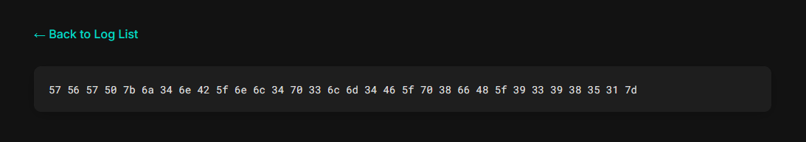

### Easy Flag

* Author: Aakansh Gupta (Unknown)

A simple web base path traversal vulnerability.
Clicking on any on the links leads to a url like: http://20.244.12.130:50002/view?file=db_errors.log
Just try and change the view?file=db_errors.log to common paths like ../app.py or ../flag.txt

Visiting http://20.244.12.130:50002/view?file=../flag.txt give:

A string of hex numbers: ` 57 56 57 50 7b 6a 34 6e 42 5f 6e 6c 34 70 33 6c 6d 34 46 5f 70 38 66 48 5f 39 33 39 38 35 31 7d `

Using CyberChef we can decode these to `WVWP{j4nB_nl4p3lm4F_p8fH_939851}`

Using a ROT6 cypher we get: `CBCV{p4tH_tr4v3rs4L_v8lN_939851}`

### The flag found is:
## CBCV{p4tH_tr4v3rs4L_v8lN_939851}
