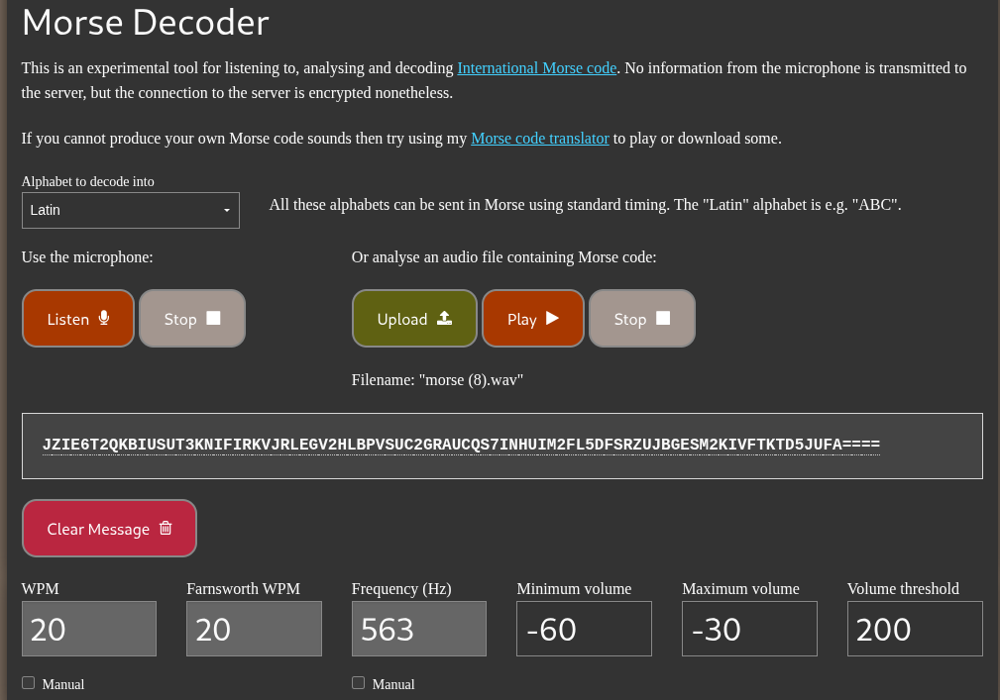
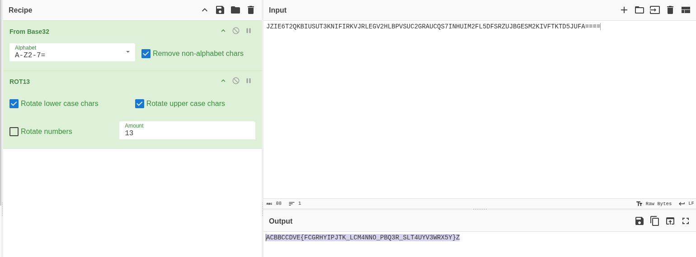

## Hidden Layers

* Author: Amarnath


### Initial Steps

1. Find Morse code.  
2. Convert to Base32.  
3. Apply ROT13.
4. Remove EVEN Postion Alphabets.


### Further Solving and Steps

```python
# Step 1: USE Morse decoder


# Step 2 & 3: Base32 decode and ROT13


# Step 4:Remove Alphabets from EVEN Postion
ACBBCCDVE{FCGRHYIPJTK_LCM4NNO_PBQ3R_SLT4UYV3WRX5Y}Z

```
### Final Flag reterived is:
## CBCV{CRYPT_C4N_B3_L4Y3R5}
