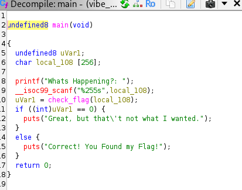
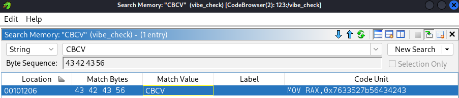
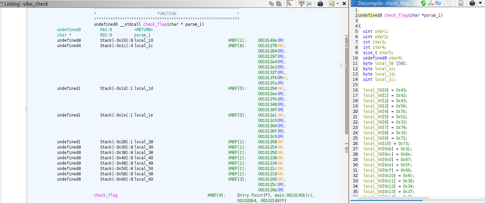

### Vibe Checker

* Author: Aakansh Gupta (Unknown)

Lets first analyze the file and its properties

```bash
┌──(kali㉿kali)-[~/Desktop/Cyscom/2]
└─$ file vibe_check                                                                                                                                          
vibe_check: ELF 64-bit LSB pie executable, x86-64, version 1 (SYSV), dynamically linked, interpreter /lib64/ld-linux-x86-64.so.2, BuildID[sha1]=11ea52dad9c5aa10a5ff59d416fb7210aa3359e9, for GNU/Linux 3.2.0, not stripped

```

Running the file gives us an option to enter some text. We need to enter the correct text to verify it.

We try to decompile the file using decompilers like gdb or Ghidra. We can see the main function of the program check the input text in a funciton to verify it. 



Since we know the flag starts with CBCV{XXXX} format, we try an search it.



Checking the check_flag function:




This Data looks like its obsfucated. We can try using rol(2 bits) or ror(3 bits), float casting and bit pattern comparisions to find the flag.
We can try use a python script like this to decode the flag from the data we found in ghidra decompiler.

```python
vals = [
    0x7633527b56434243,
    0x665f676e31737233,
    0x5f676e313734306c,
    0x315f53744e313070,
    0x725f597a34655f35,
    0x7d36335f74686731,
]

data = b''.join(v.to_bytes(8, 'little') for v in vals)
print(data.rstrip(b'\x00').decode('ascii', errors='replace'))
```

Running the script produces the output as the required flag.

### The flag found is:
## CBCV{R3v3rs1ng_fl0471ng_p01NtS_15_e4zY_r1ght_36}
