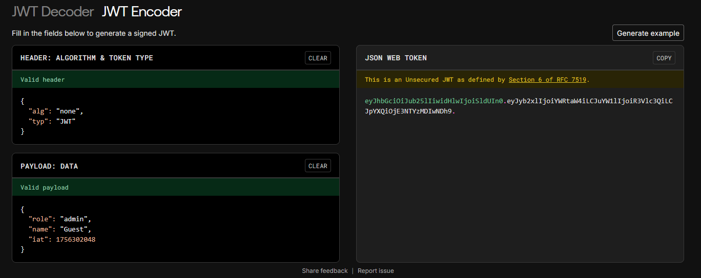
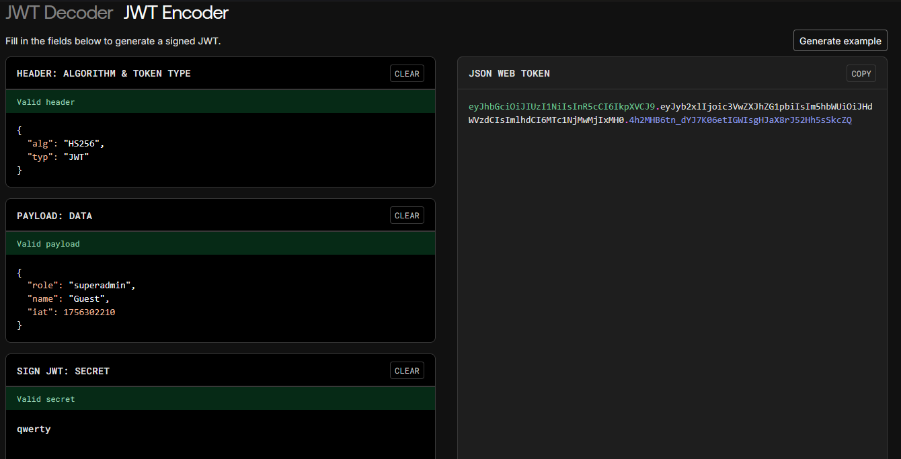

### I am Who?

* Author: Aakansh Gupta (Unknown)

A longer version of it's parent CTF `who am i` . This requires none Algorithm attack and secret key verification.

Visit the given page and check the cookie.
This time we have an admin page.
This requires elevated privilages.

Use jwt.io to encode a cookie without any algorithm to bypass auth.

This allows access to admin panel. But this isnt the end, we reqire another endpoint `finalcheck`
And a new role called `superadmin` is needed.
We can brute force common secret keys like `secret` or `qwerty` (in this case its `qwerty`).

Using jwt.io we craft a cookie and send it.

Now we can access the /finalcheck endpoint and see the flag.

### The flag found is:
## CBCV{w34K_S3Cr3T_K3y_Cr4CK3d_835}
