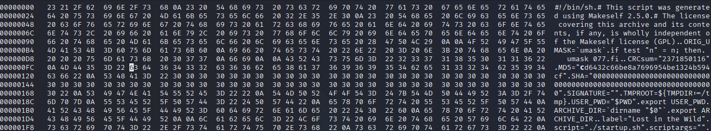

### Locked

* Author: Aakansh Gupta (Unknown)

Lets first run the file and its properties

```bash
┌──(kali㉿kali)-[~/Desktop/Cyscom/5]
└─$ ./challenge.run 
Verifying archive integrity...  100%  Error in MD5 checksums: cd6432c66be8a7696954be1324b594cf is different from 6432c66be8a7696954be1324b594cf
```

Running the file tells us that there are errors in MD% checksums.
If we try to match the hash using editors like VSCode or Nano (Non-hex editors), the file is corrupted.

```bash
┌──(kali㉿kali)-[~/Desktop/Cyscom/5]
└─$ ./challenge.run   
Verifying archive integrity... Unexpected archive size.

```

To try and fix the MD5 Check, we need to use hex editors like `hexedit`. 
We know 2 in hex is 32 and 0 in hex is 30.
Replace these values with the hexeditor where there are 0s.



Now run the file again. We get the flag

```bash
┌──(kali㉿kali)-[~/Desktop/Cyscom/5]
└─$ ./challenge.run      
Verifying archive integrity...  100%   MD5 checksums are OK. All good.
Uncompressing Lost in the Wild  100%  
CBCV{h3x_3dIt0r5_t0_Th3_r3scU3_9364}
```


### The flag found is:
## CBCV{h3x_3dIt0r5_t0_Th3_r3scU3_9364}
