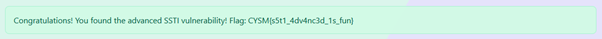

# CYSCOM JUICE SHOP WALKTHROUGH

 

The CYSCOM JUICE SHOP, like OSWAP Juice Shop,includes a broad spectrum of vulnerabilities from simple input-based flaws to logic and design-level flaws. Understanding the rationale behind each exploit reinforces the importance of layered security, input validation, and robust authentication design.
This document provides a detailed analysis of each challenge presented in the CYSCOM Juice Shop Challenge. Each vulnerability is explained alongside its exploitation method and the flag retrieval steps.

## TASK 1: MAIN FLAGS

### Initial Login Page & SQL Injection
 
The login form is susceptible to SQL Injection, allowing attackers to bypass authentication without knowing valid credentials. This is due to improperly sanitized user inputs in SQL queries.

Examples of payloads:
```
admin' –
admin';--
admin' /*
' UNION SELECT 1,2,3,1,'admin
```

Entering these in the username followed by any password lets the user login as admin.

> [!NOTE]
> OR-based injections are filtered, requiring alternative payloads.

   

 

<hr>

### Admin Panel Disclosure

The `/admi`n endpoint, typically hidden, becomes accessible post-SQL injection login. This panel leaks usernames and passwords of all registered users, indicating a <b>Sensitive Data Exposure</b> vulnerability.

 

 

<b>Flag Retrieval:</b> Visiting this hidden endpoint grant the user a flag. 

 

The leaked credentials can be used to authenticate normally to ‘admin’ user and retrieve the corresponding flag. 

 

<hr>

### Documentation Panel - Token Access

This panel is visible only on admin login and shows some open endpoints that we can access.

 

 

 

This panel reveals hidden endpoints, accessible only via a Base64-encoded token in the format:

```
base64("username:date")
```

This mechanism mimics an insecure form of token-based access control and can be exploited for endpoint access.


<b>Flag Retrieval: </b> Visiting `/api/v1/internal/users` endpoint:

 

 

 

Also visiting `/api/v1/backup?token=` with the correct token of format `(admin:time)` in base64 format, leads to:

Eg: `https://vul-webapp.onrender.com/api/v1/backup?token=YWRtaW46MjEzCg==`

 

 

<hr>

### IDOR (Insecure Direct Object Reference)

Users can add and view personal notes with titles and some body. These also supports HTML formatting. By modifying the note ID in the URL (e.g., /note/2 to /note/1), we can access notes belonging to other users.
Vulnerability Impact: Lack of access control on object references allows unauthorized data exposure.

  to  

 

<hr>

### Cross Site Scripting (XSS)

HTML input fields when not sanitized allow malicious scripts to be saved and executed in the browser of other users. This compromises session tokens or redirects victims.

Since the notes supports HTML formatting. We can inject code into these notes using basic HTML scripts.

 

 

<hr>

### Encoded Cross Site Scripting

Most websites sanitize the user inputs to prevent XSS vulnerabilities in their webpages by not allowing syntax or text for certain formats. We can bypass this using encoding text to their ascii values or decimal values and injecting the XSS. Browsers decode these before rendering, reactivating the payload.

Eg: `<script>&#97;&#108;&#101;&#114;&#116;(1)</script>`

 

 

<hr>

### Server-Side Template Injection (SSTI)

Unsensitized input can sometimes be passed into server-side template engines (like Jinja2). If expressions are interpreted, attackers can run arbitrary code.
For example: 
```
 {{7*7}} => 49
```
This can lead to full server compromise if RCE is possible.

You can inject Server-side templates to the file search of option to reveal sensitive data. This happens when the user input is not sanitized.

 

 

 

<hr>

### Advanced SSTI
Expanding SSTI beyond one field demonstrates lack of sanitization across the app, suggesting systemic weaknesses in input validation such as input to the title of user notes.

 

 

<hr>

### Event-Based Cross Site Scripting

Event handlers like onerror are triggered under certain browser events. Injecting them into inputs can cause malicious execution without direct user interaction

 

 

 

<hr>

### Broken Authentication - Token Forgery

The application allows password resets via a token which is easily found on the “/admin” endpoint. Lack of proper validation enables unauthorized access.

 

We need to make a base64 encode token of format:
```
 username:date (eg: user:02, cabinet:21)
```
And convert it to `base64`.
We can then use this token to reset password of the account.
This gives us the broken authentication flag.

 

 

Only few accounts have the ability to reset password. Not all accounts can reset the password.

<hr>

### Lost User (OSINT Challenge)

This is an OSINT challenge that starts by logging in to the `cabinet` user. This user already has a note with a heading “remember the date” and a link to a webpage.

 

It also has another note that states that the official account `cyscom` is scheduled for deletion because the password was too easy to guess (a date).

On clicking the link to the webpage, we can scroll down to find a timeline to events.

 

Trying the date 15012022 (15 January 2022) as the password for `cyscom` user, we get access to the account that is to be removed. 

 

Clicking the `view Flags` button, we are given the Lost User flag.

 

<hr>

### Type Juggling (PHP)

Type juggling or type casting refers to a PHP functionality. Since PHP does not require explicit type definition in variable declaration, a string can be assigned to a variable ‘a’ and later on an int can also be assigned to variable ‘a’. 
```
 '0e12345' == '0e54321' // true in PHP
```

If the computed hash only contains numbers after the first `0e`, PHP will treat the hash as a float. A password hash that begins with `0e` will always appear to match the strings, regardless of what they actually are.
This can be used to bypass authentication in vulnerable PHP programs. We can emulate this in our webpage by sending a POST request as:
```
curl -X POST "https://SERVER_IP/api/v1/verify_backup" -H "Content-Type: application/json" -H "Cookie: session=YOUR_SESSION_COOKIE" -d "{\"id\":123,\"hash\":\"0e123456789\"}"
```

 

This request sends a request with these parameters:
```
{
 "id": 123,
 "hash": "0e123456789"
}
```
To the `/api/v1/verify_backup` endpoint, which bypasses the authentication with an hash starting with 0e.

> [!NOTE]
> In the above request, replace SERVER\_IP with the website IP address & YOUR\_SESSION\_COOKIE with your session token. This can be found using inspect element. In Firefox, it can be found at:
>  

<hr>

### Prototype Pollution (JavaScript)

Prototype pollution is a JavaScript vulnerability that enables an attacker to add arbitrary properties to global object prototypes, which might be inherited by user-defined objects. This vulnerability let’s an attacker control property of objects that would otherwise be inaccessible. 
JavaScript objects inherit from Object.prototype. Injecting into `__proto__` alters default properties application-wide, potentially bypassing logic or introducing backdoors.

To emulate this, we can send a curl request to the server using this data:
```
{
 "__proto__": {
 "polluted": true
 }
}
```
Example command:
```
curl -X POST "https://SERVER_IP/api/v1/user/preferences" \ -H "Content-Type: application/json" \ -H "Cookie: session=YOUR_SESSION_COOKIE" \ -d "{\"normal_key\": \"normal_value\", \"__proto__\": {\"polluted\": true}}"
```

 

> [!NOTE]
> In the above request, replace SERVER\_IP with the website IP address & YOUR\_SESSION\_COOKIE with your session token. This can be found using inspect element.

<hr>

## TASK 2: BONUS FLAGS

### Image Steganography
Data is hidden within image files using LSB or metadata techniques. Tools like zsteg extract such hidden data.
Logging into user `Unknown` gives us an image in the notes

 

We can download this image and try to run text extraction techniques on it such as steghide, zsteg, etc.

 

Using `zsteg`, we can see the flag hidden in the image.

<hr>

### Audio Steganography
Logging into the user `user`, we can see that this user has a .wav file as a note. Downloading and running this through a spectrogram generator gives us the flag.

 

<hr>

### Hidden in plain sight
A flag is revealed to the user in the documentation page of the webpage as the DEBUG\_KEY. 

 

<hr>

### Discussions Tab
 

Taking the first letter of every comment from 2nd to 3rd last gives CYSM, our flag format. The 2nd last comment give us the full flag `CYSM{dafweyif29ybvf23d}`
