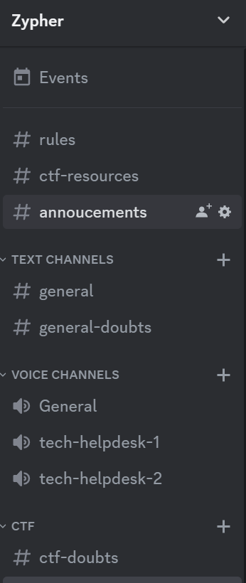
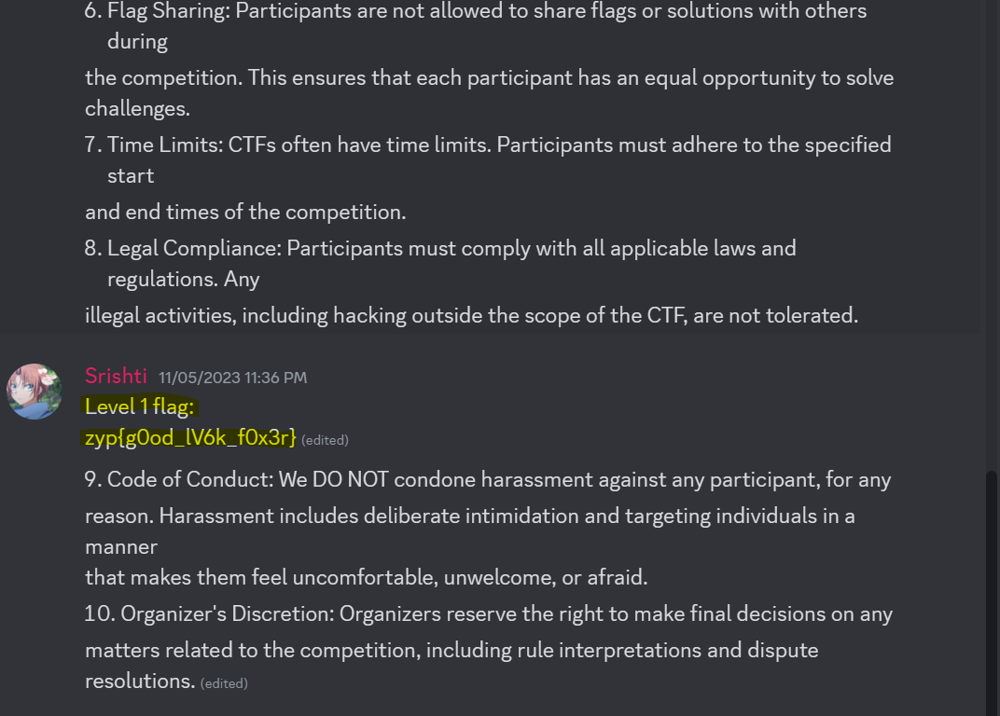

## Challenge

Checkout our [Discord Server](https://discord.gg/W6cMrmkP)

## Solution

Join the Discord Server with the link provided and you get to see the following channels

{: width="174" height="410" }

Your goal is to locate the flag. In `#announcements` channel you can see the flag inbetween the rules as show in the image below 👇🏻

{: width="70%"}

That's it! You've successfully completed Level 1 by following the hints and rules.
