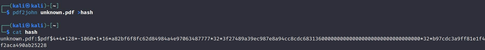
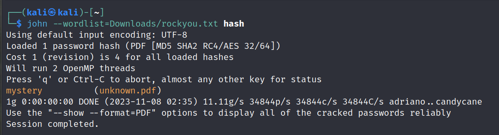

## Challenge

You are given a [PDF](writeupfiles/level3/unknown.pdf)

## Solution

You need to first extract the crackable information from the file using `John the Ripper` tool.

```bash
$ pdf2john.py unknown.pdf > hash
```



Now, crack the hash using `John the Ripper` tool.

```bash
$ john hash --wordlist=/usr/share/wordlists/rockyou.txt hash
```

{: width="70%"}

Now, you can see the password for the PDF file is `mystery`. Use this password to open the PDF file and you will get the flag.

{: width="70%"}
