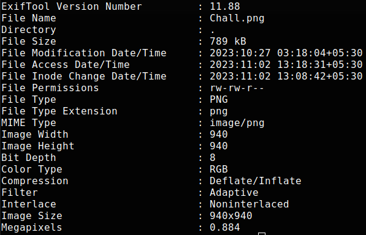
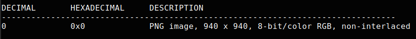

## Challenge

This is a basic forensics challenge. You are given an image file [Leo's Sinister Bellow](writeupfiles/level4/Chall.png)

## Solution

First thing to do in any steganography challenge is an `exiftool` check. This will tell you if there is anything hidden in the metadata of the image

```bash
$ exiftool 1.png
```

{: width="70%"}

Unfortunately, there is nothing in the metadata. Next, we can use `binwalk` to check for any hidden files in the image.

```bash
$ binwalk 1.png
```

{: width="70%"}

We can see that there are no files hidden in the image. This means that some other
encoding technology has been used.

The description asks us the examine the image closely.

With this information we can suspect that the method used for hiding the flag is LSB
encoding.

In order to perform LSB extraction, we will need some tools.

The tool I will be using is stegolsb

[https://pypi.org/project/stego-lsb/](https://pypi.org/project/stego-lsb/)

Running the stego-lsb tool on the image gives us the flag.

```bash
$ stegolsb steglsb -r -i Chall.png -o out.txt -n 1
```

```bash
$ cat out.txt | grep zyp
```
