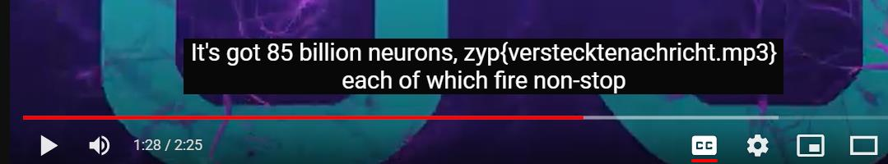
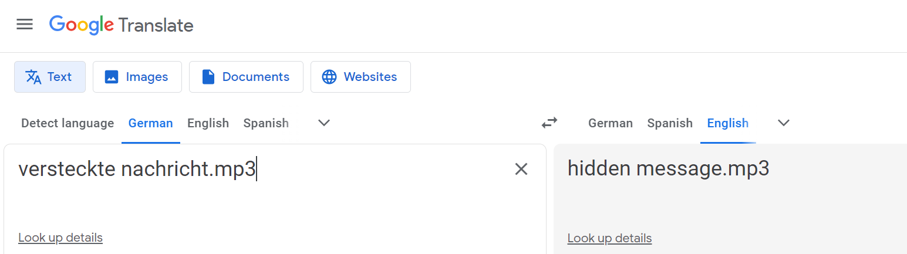

## Challenge

A YouTube video link is given [YouTube Video](https://www.youtube.com/watch?v=Gf1KJakdt3E)

## Solution

The flag is hidden in the Subtitles of the video. You can see the subtitles by clicking on the CC button in the video.

At 1:28, you can see the flag.

{:width="70%"}

The flag is in foriegn language. You can translate it using Google Translate.

{:width="70%"}
