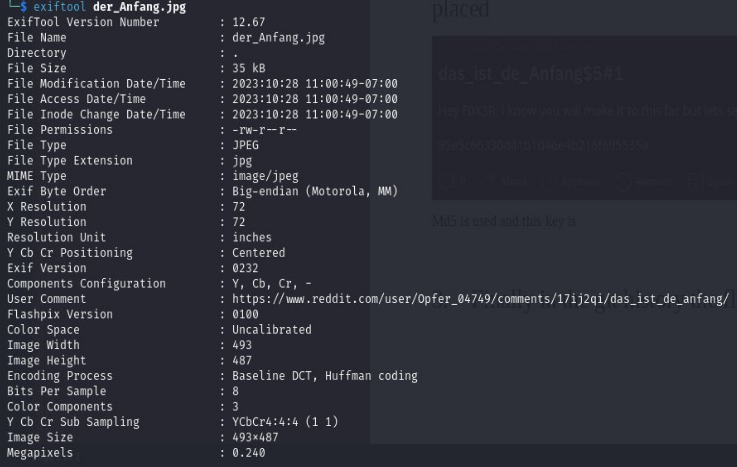
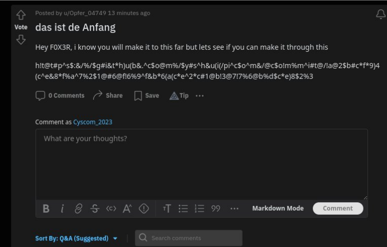
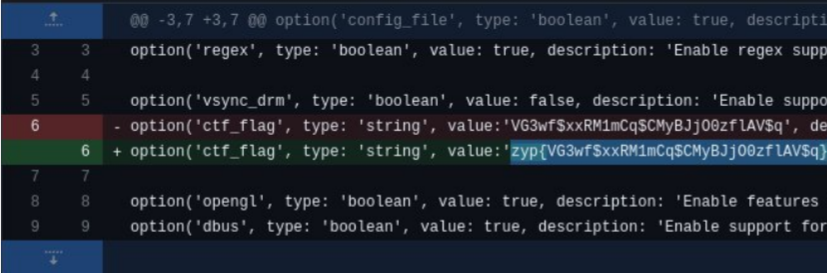

## Challenge

An image file is given. [Der Anfang](writeupfiles/level6/der_Anfang.jpg)

## Solution

The link to the social media post is given in the meta data of the image file in the id name of UserComment and the meta data can be viewed using exiftool.

```bash
$ exiftool der_Anfang.jpg
```

{:width="70%"}

In the reddit post the link to the git history is salted and placed

{:width="70%"}

Link after removing unwanted special characters 👇🏻

[https://github.com/yshui/picom/commit/a2bcf94ce8fa7216f69fb6ace2c1b3776bdce823](https://github.com/yshui/picom/commit/a2bcf94ce8fa7216f69fb6ace2c1b3776bdce823)

The flag is in the commit message.

{:width="70%"}
