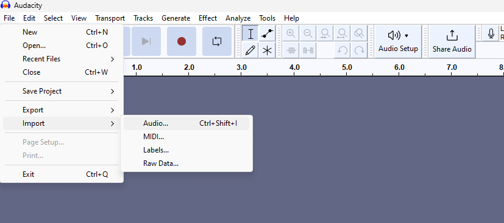
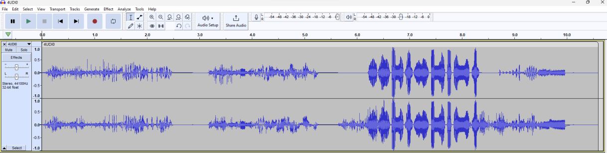
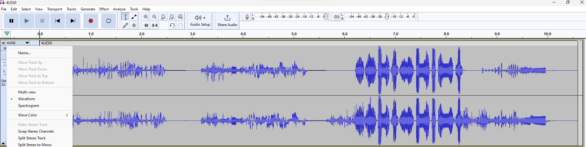
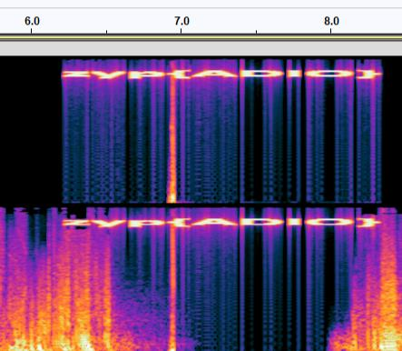

## Challenge

A audio file is given [4UDI0.mp3](writeupfiles/level7/4UDI0.mp3)

## Solution

Audacity can be used to view the spectogram to an audio

Import the audio file in the project

{:width="70%"}

A waveform will be displayed

{:width="70%"}

Right click the track and choose spectrogram

{:width="70%"}

The flag is displayed in the spectrogram at 6 seconds

{:width="70%"}
