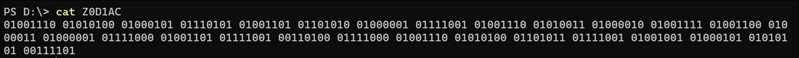
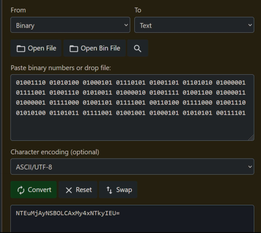
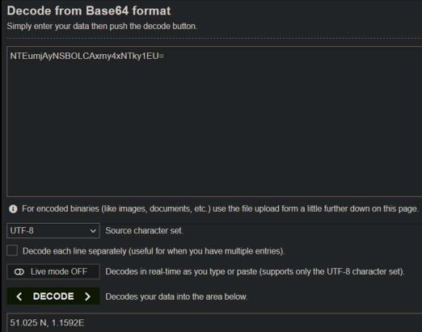

## Challenge

You have given a file [Z0D1AC](writeupfiles/level8/Z0D1AC)

## Solution

View the file contents using `cat`

```bash
$ cat Z0D1AC
```



So we can copy the binary and use an online decoder to convert the binary to human readable text.

{:width="60%"}

Now we get this new ciphered test which contains the coordinates of the location. This is `base64` encoded. So we can use an online decoder to decode the text.

{:width="70%"}

Enclose the result in `zyp{}` as the flag format.
