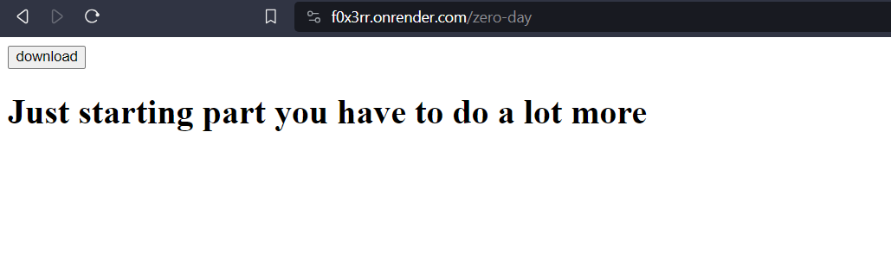

## Challenge

You are given a [website](https://f0x3rr.onrender.com/)

## Solution

In the website, f0x3rr is a endpoint

{:width="70%"}

Click Download and a file will be downloaded

{:width="70%"}

Convert this decimal to string using online converter and you'll get a github and in the issue section there will be a password hidden in the conversation

Password is `zero-day`

{:width="80%"}

{:width="80%"}

When you visit the endpoint, click the download button and you'll Zypher event poster

{:width="60%"}

{:width="60%"}

{:width="50%"}

Scan the QR code and you'll get a `base64` encoded string, decode it and you'll get a link an endpoint `/vitcyscomzypher`

{:width="80%"}

Go to the endpoint and download the file

{:width="80%"}

{:width="80%"}

Convert the binary to string

{:width="60%"}

Decoding the Caesar cipher

{:width="70%"}
