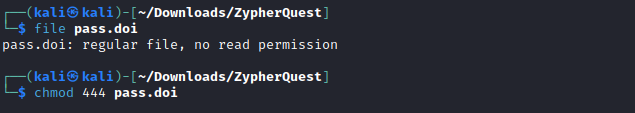

## Challenge

You are given a file [ZypherQuest](writeupfiles/level10/ZypherQuest)

## Solution

As the file don't have any extension, we can use `file` command to check the file type

{:width="90%"}

You can see it is a zip file. Now use `unzip` to extract the file

{:width="90%"}

You can see the extracted file is a gzip file which is archived using tar. You can see 3 new files have been extracted.

{:width="90%"}

{:width="60%"}

You may want to read the following files but skipping that, we check the file
type for Seal.

{:width="90%"}

The given file is a bzip2 compressed data. To unzip the file, we can firstly
rename the file to add .bz2 extension and proceed to unzip it using bzip2. This
gives us a tar file which can be further extracted using tar.

```bash
mv Seal Seal.bz2
bzip2 -d Seal.bz2
tar -xvf Seal
```

Instead of these 3 steps we can directly uncompressed the given data “Seal”
using tar -xjf command.

{:width="90%"}

We can see new files have been uncompressed. We also see a file named
Start.sh which is a script file. We can try running this using ./Start.sh. Running it
essentially does nothing but delete old files cluttering the screen if they
weren’t already deleted. We can try and read some files to try and get some
clues. Here the file Admin looks interesting. Checking its file type, we see it is another tar file.

{:width="90%"}

{:width="90%"}

Extracting it gives us a file name Z0d1aCisWatching. We again check the file
type and try decompressing it.

{:width="90%"}

{:width="90%"}

Further checking the decompressed file (data in this case) We see a tar file
again. Decompressing it gives an interesting file.

{:width="90%"}

Checking its file type shows there are no permissions assigned to the given file. So, we used chmod 444 or chmod +r to make the file readable.

{:width="50%"}
