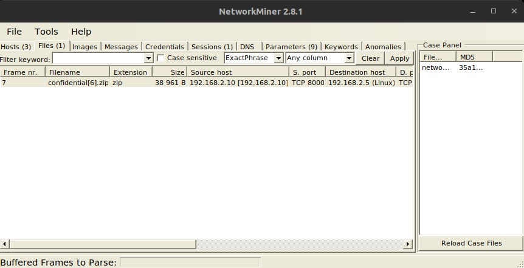
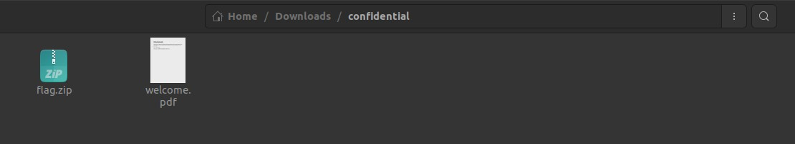
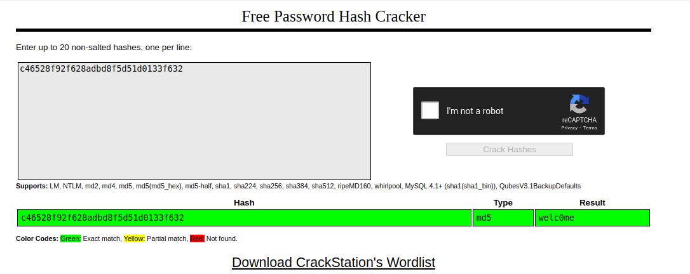
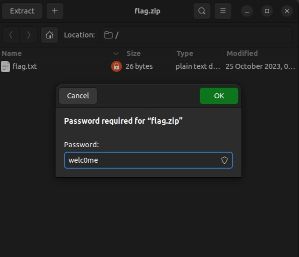

## Challenge

You are given a [network_mitm.pcap](writeupfiles/level12/network_mitm.pcap) file

## Solution

Extract contents using [NetworkMiner](https://www.netresec.com/?page=NetworkMiner)

{:width="70%"}

Load in the pcap file and extract the zip file

{:width="70%"}

Extract flag.zip using hashed password inside welcome.pdf

Decrypt hashing using [CrackStation](https://crackstation.net/)

{:width="70%"}

Extract the files using password `welC0me`

{:width="60%"}

```bash
$ cat flag.txt
```
