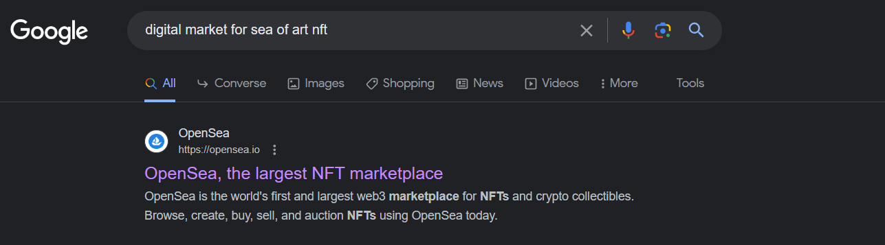
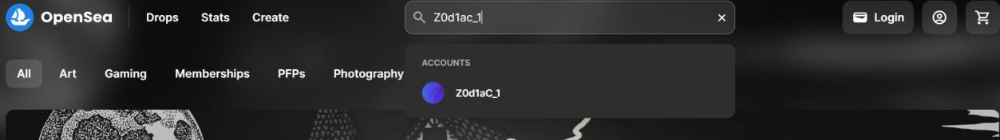
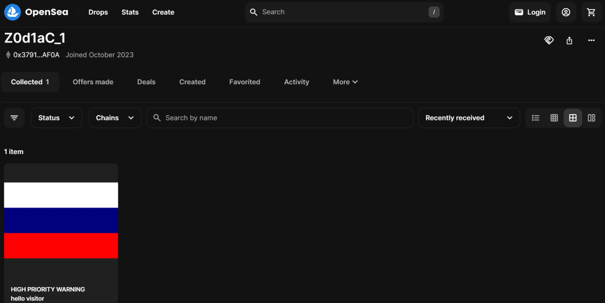
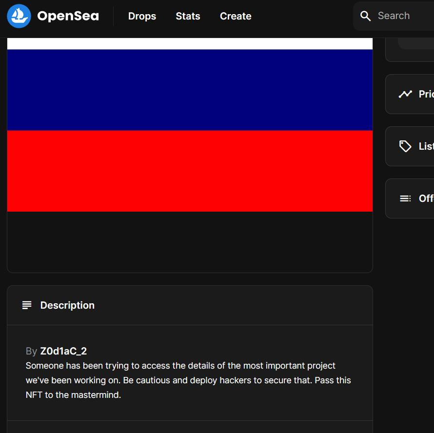
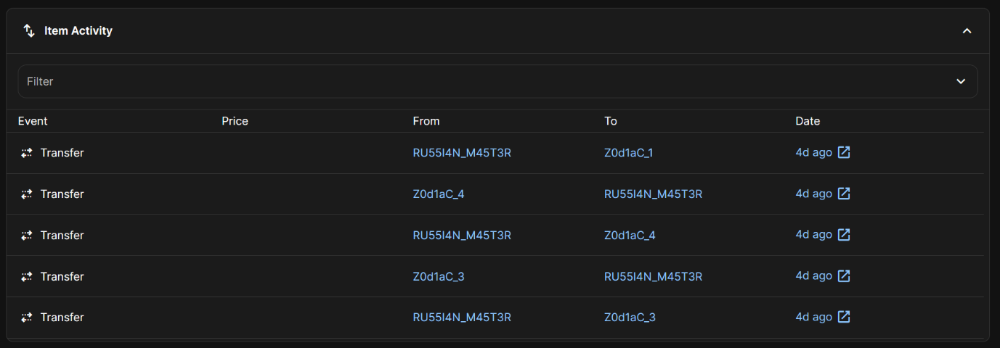
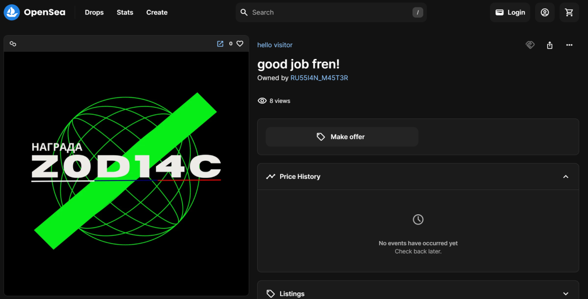
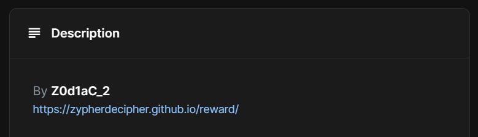
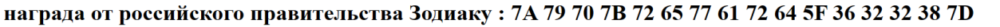
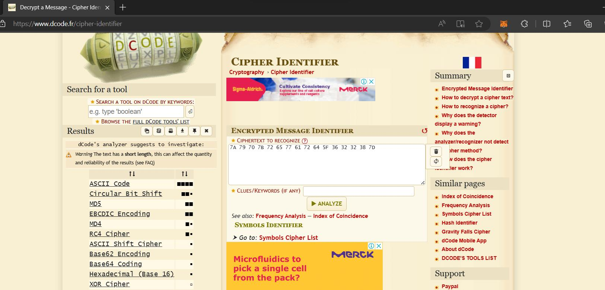
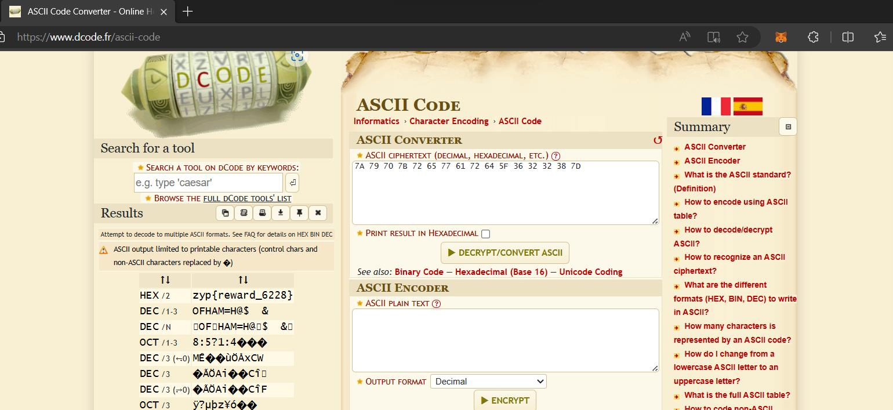

## Challenge

You have been given a file called [image.nft](writeupfiles/level13/image.nft)

### Hints

1. Look at this [hint](writeupfiles/level13/hint1.txt)

## Solution

Download the file

Here `Z0d1ac_1` seems to look like a username. Let's google `digital market for sea of art` and see if something related to nfts comes up.

{:width="80%"}

The first link itself comes up to be the biggest nft marketplace and we the link the word `sea` to opensea from previous hint. Lets lookup for `Z0d1ac_1` username in opensea.

{:width="80%"}

{:width="80%"}

On the profile page of Z0d1ac_1 you can see the same nft as image.nft file, open
the NFT

{:width="70%"}

In the description it key is `mastermind`

When you look in the item activity section, you’ll find transfers between different entities of Z0d1ac but one suspicious account involved in all these transfers is `RU55I4N_M45T3R`

{:width="80%"}

When you look for the `RU55I4N_M45T3R` username, you’ll find another NFT

{:width="80%"}

{:width="80%"}

In the description you can see the reward link

{:width="80%"}

Go to [https://www.dcode.fr/cipher-identifier](https://www.dcode.fr/cipher-identifier) and look for possible ciphers

{:width="80%"}

Here we can see that highest probability is for ASCII Code

{:width="80%"}
