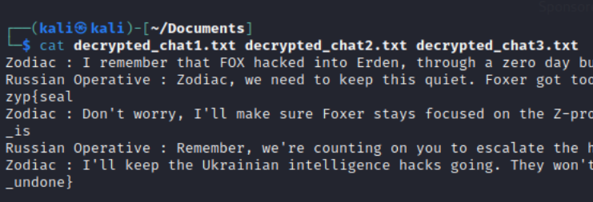

## Challenge

You have been given a file [7.1.zip](writeupfiles/level14/7.1.zip)

## Solution

We know that the files are RSA encrypted since we are given private keys for each of them We will use the following command to decrypt each of them

```bash
openssl pkeyutl -decrypt -inkey private_key1.pem -in encrypted_file1.bin -out decrypted_chat1.txt
```

```bash
openssl pkeyutl -decrypt -inkey private_key2.pem -in encrypted_file2.bin -out decrypted_chat2.txt
```

```bash
openssl pkeyutl -decrypt -inkey private_key3.pem -in encrypted_file3.bin -out decrypted_chat3.txt
```

{:width="70%"}
