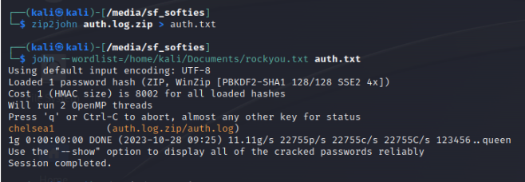
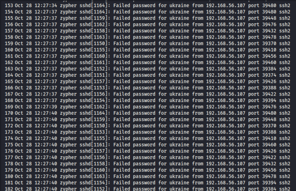

## Challenge

You have been given a file [auth.log.zip](writeupfiles/level15/auth.log.zip)

## Solution

We can see that the zip file is password-protected

So we have to use a dictionary-based attack tool to brute-force the password

```bash
$ zip2john auth.log.zip > auth.txt
```

{:width="70%"}

This will give you the password, use it to unzip the file and go through it

{:width="70%"}

As we can see the attacker used SSH brute force to hack into the machine

The answer is SSH bruteforce (hydra)
